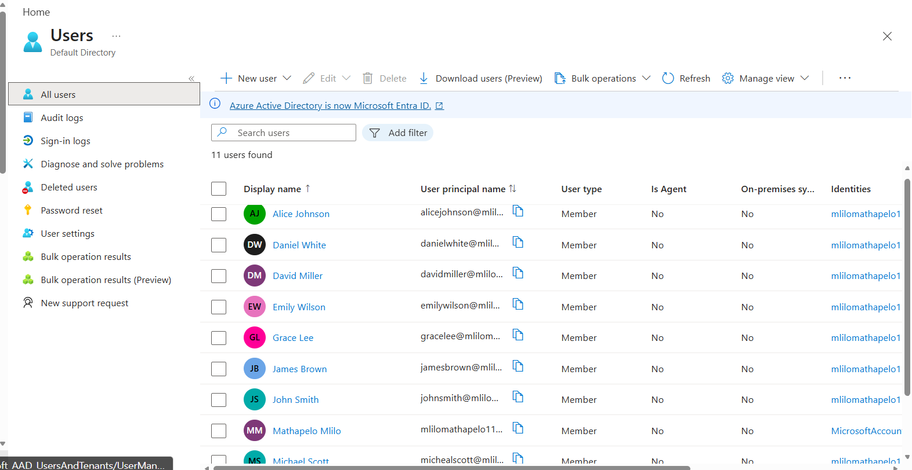
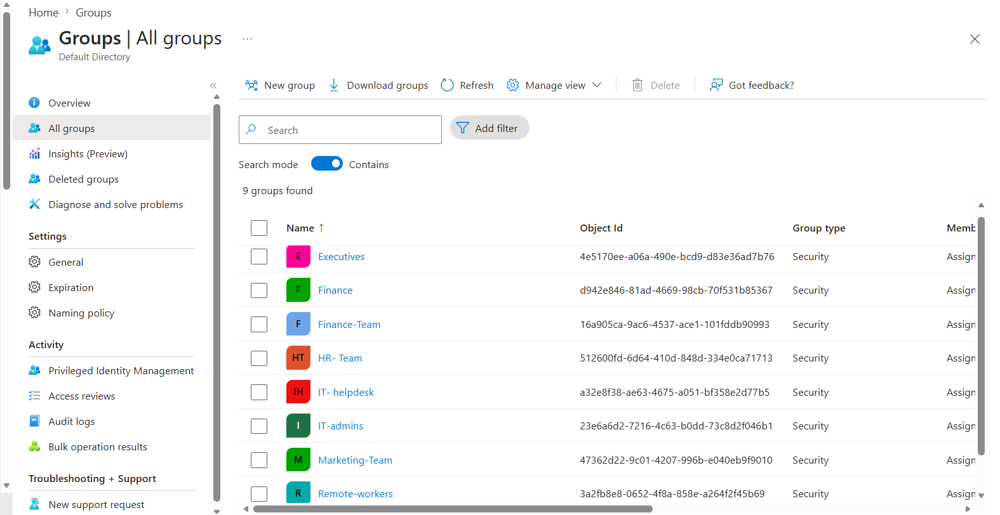
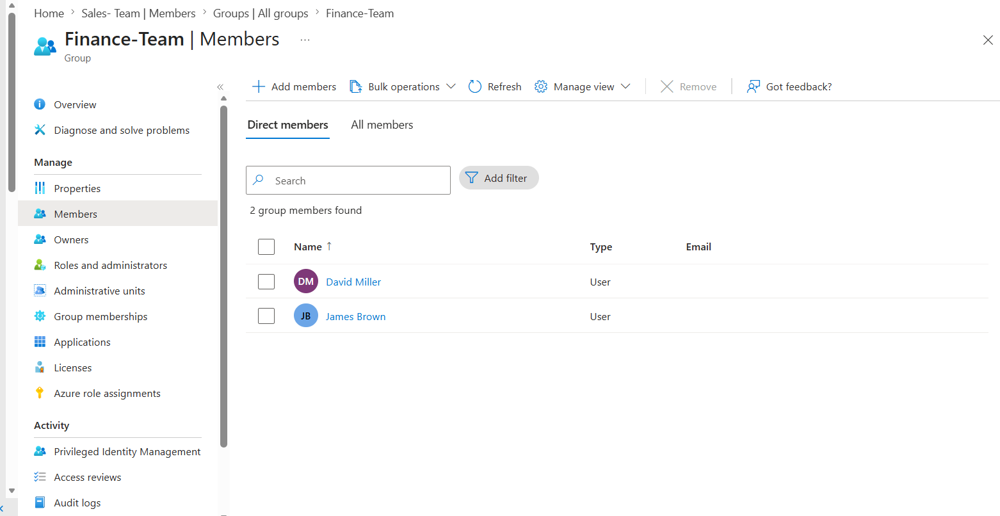
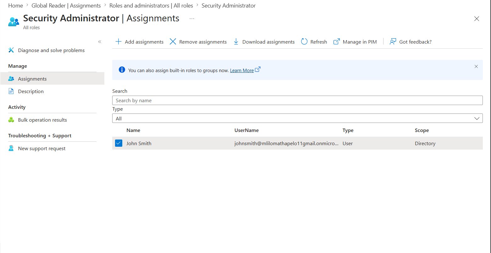
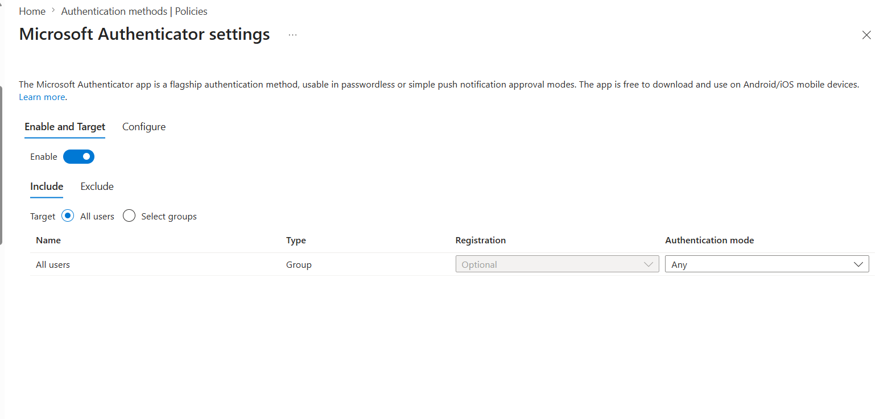
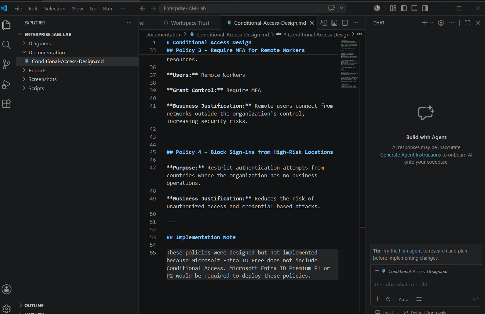
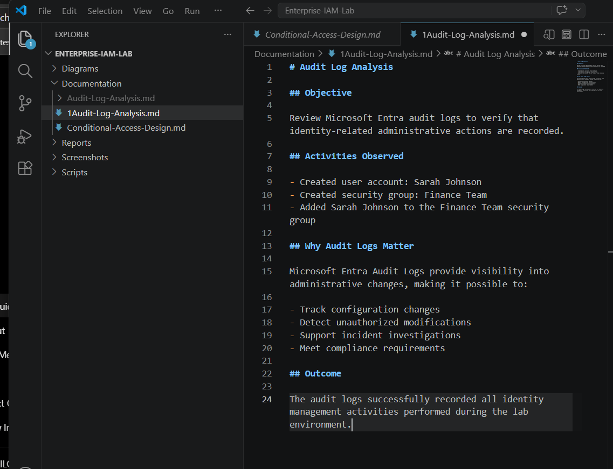
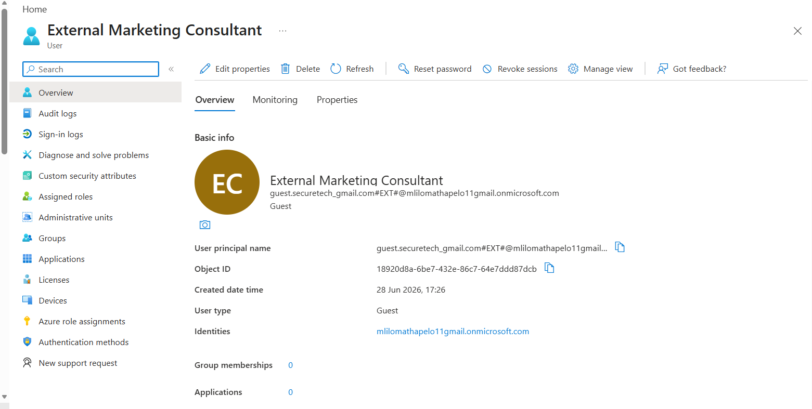

# Enterprise Identity and Access Management (IAM) Lab

## Secure Tech Solutions – Microsoft Entra ID Enterprise IAM Project

## Table of Contents

- [Project Overview](#project-overview)
- [Business Scenario](#business-scenario)
- [Project Objectives](#project-objectives)
- [Technologies Used](#technologies-used)
- [Skills Demonstrated](#skills-demonstrated)
- [Project Architecture](#project-architecture)
- [Implementation Phases](#implementation-phases)
- [Project Screenshots](#project-screenshots)
- [Joiner-Mover-Leaver (JML) Workflow](#joiner-mover-leaver-jml-workflow)
- [Security Assessment](#security-assessment)
- [Repository Structure](#repository-structure)
- [Future Improvements](#future-improvements)
- [Conclusion](#conclusion)

## Project Overview

This project demonstrates the implementation of core Identity and Access Management (IAM) capabilities using Microsoft Entra ID. A fictional organization, **Secure Tech Solutions**, was created to simulate a real-world enterprise environment where users, departments, security groups, administrative roles, authentication methods, audit logging, and external collaboration were configured following industry best practices.

The project focuses on establishing a secure identity infrastructure using Microsoft Entra ID Free while documenting enterprise security features that require Microsoft Entra ID Premium. Where licensing limitations prevented implementation, detailed design documentation was created to demonstrate knowledge of enterprise identity security architecture.

This repository showcases practical IAM skills including user lifecycle management, Role-Based Access Control (RBAC), Multi-Factor Authentication (MFA), audit logging, sign-in monitoring, guest user management, and Joiner-Mover-Leaver (JML) lifecycle planning.

## Business Scenario

Secure Tech Solutions is a fictional technology company used to simulate an enterprise Identity and Access Management deployment. As the organization expands, it requires a centralized identity platform capable of securely managing employee accounts, departmental access, administrator privileges, authentication methods, audit logging, and external collaboration.

As the Identity and Access Management Administrator, the objective was to design and implement a secure identity environment using Microsoft Entra ID while following the principles of Zero Trust and least privilege. The project also includes security documentation and architectural planning for advanced identity protection features that require Microsoft Entra ID Premium licensing.

## Project Objectives

The primary objectives of this project were to:

* Build a simulated enterprise environment using Microsoft Entra ID.
* Create organizational departments and user accounts.
* Implement security groups for simplified access management.
* Configure Role-Based Access Control (RBAC) using administrator roles.
* Strengthen account security by enabling Multi-Factor Authentication (MFA).
* Design enterprise Conditional Access policies based on Zero Trust principles.
* Monitor identity activity using Microsoft Entra audit logs and sign-in logs.
* Demonstrate secure external collaboration through Microsoft Entra B2B guest users.
* Create a Joiner-Mover-Leaver (JML) workflow to illustrate the employee identity lifecycle.
* Produce professional documentation suitable for an enterprise IAM project portfolio.

## Technologies Used

* Microsoft Entra ID Free
* Microsoft Entra Admin Center
* Microsoft Authentication Methods
* Microsoft Entra Audit Logs
* Microsoft Entra Sign-In Logs
* Microsoft Entra B2B Collaboration
* Role-Based Access Control (RBAC)
* Multi-Factor Authentication (MFA)
* Visual Studio Code
* Markdown
* Draw.io
* Git
* GitHub

## Skills Demonstrated

Throughout this project, the following Identity and Access Management skills were demonstrated:

* Identity administration
* User provisioning and lifecycle management
* Department and security group administration
* Group-based access management
* Role-Based Access Control (RBAC)
* Multi-Factor Authentication (MFA)
* Zero Trust security principles
* Conditional Access design
* Audit log analysis
* Sign-in log analysis
* Guest user management (Microsoft Entra B2B)
* Security assessment and documentation
* Joiner-Mover-Leaver (JML) workflow design
* Enterprise documentation using Markdown
* GitHub project documentation

# Project Timeline

| Phase | Description | Status |
|-------|-------------|--------|
| Phase 1 | Enterprise Environment Setup | ✅ Completed |
| Phase 2 | Security Groups | ✅ Completed |
| Phase 3 | Group Membership | ✅ Completed |
| Phase 4 | Role-Based Access Control (RBAC) | ✅ Completed |
| Phase 5 | Multi-Factor Authentication (MFA) | ✅ Completed |
| Phase 6 | Conditional Access Design | ✅ Completed |
| Phase 7 | Audit Log Analysis | ✅ Completed |
| Phase 8 | Sign-in Log Analysis | ✅ Completed |
| Phase 9 | Guest User (B2B Collaboration) | ✅ Completed |
| Phase 10 | Security Assessment | ✅ Completed |
| Phase 11 | Joiner-Mover-Leaver (JML) Workflow | ✅ Completed |

---

# Project Implementation

The following sections document each phase of the Identity and Access Management implementation for Secure Tech Solutions.

---

# Phase 1 — Enterprise Environment Setup

The project began by creating a simulated enterprise environment within Microsoft Entra ID.

Departments created:

- Executive
- IT
- Finance
- Human Resources
- Marketing
- Sales

Employee accounts were created and assigned to the appropriate departments to simulate a real-world organization.

### Screenshot



---

# Phase 2 — Security Groups

Security Groups were created to simplify access management and improve administrative efficiency.

Each department received its own dedicated security group to support scalable permission management.

### Screenshot



---

# Phase 3 — Group Membership

Users were added to the appropriate Security Groups based on their department and business role.

This demonstrates group-based access management rather than assigning permissions directly to individual users.

### Screenshot



---

# Phase 4 — Role-Based Access Control (RBAC)

Administrative permissions were assigned using Microsoft's built-in Role-Based Access Control model.

The Security Administrator role was delegated to an authorized administrator while following the Principle of Least Privilege.

### Screenshot



---

# Phase 5 — Multi-Factor Authentication (MFA)

Authentication security was strengthened by enabling Microsoft Authenticator and SMS authentication methods.

This reduces the likelihood of unauthorized account access resulting from compromised credentials.

### Screenshot



---

# Phase 6 — Conditional Access Design

Microsoft Entra ID Free does not support Conditional Access policies.

To demonstrate enterprise IAM knowledge, a complete Conditional Access design document was created outlining how these policies would be implemented within a Microsoft Entra ID Premium environment.

Designed policies included:

- Require MFA for Administrators
- Block Legacy Authentication
- Require MFA for Remote Workers
- Block High-Risk Countries

### Screenshot



---

# Phase 7 — Audit Log Analysis

Microsoft Entra Audit Logs were reviewed to verify that identity-related administrative activities were successfully recorded.

Activities monitored included:

- User creation
- Security group creation
- Group membership changes

These logs are essential for auditing administrative changes and supporting incident investigations.

### Screenshot



---

# Phase 8 — Sign-In Log Analysis

Microsoft Entra Sign-In Logs were analyzed to understand authentication activity across the environment.

Information reviewed included:

- Username
- Application
- IP Address
- Geographic Location
- Timestamp
- Authentication Result

Sign-in monitoring assists security teams in identifying suspicious authentication activity.

### Screenshot


---

# Phase 9 — Guest User (B2B Collaboration)

A guest user was invited to simulate secure collaboration with an external marketing consultant.

Microsoft Entra B2B enables organizations to securely collaborate with vendors, contractors, consultants, and business partners while maintaining centralized identity governance.

### Screenshot



---

# Phase 10 — Security Assessment

Following implementation, a security assessment was conducted to evaluate the overall identity security posture.

The assessment reviewed:

- Identity architecture
- Authentication security
- Administrative delegation
- Identity monitoring
- Guest access
- Enterprise documentation

Recommendations were documented for future implementation using Microsoft Entra ID Premium.

---

# Phase 11 — Joiner-Mover-Leaver (JML) Workflow

A professional Joiner-Mover-Leaver workflow was designed using Draw.io to demonstrate how employee identities should be managed throughout their lifecycle.

The workflow documents the onboarding, internal transfer, and offboarding processes while following enterprise Identity Governance best practices.

### Enterprise JML Workflow


---

# Key Learning Outcomes

Completing this project strengthened both my technical and documentation skills in enterprise Identity and Access Management. Throughout the implementation, I gained practical experience in:

- Designing a secure enterprise identity environment using Microsoft Entra ID.
- Creating and managing users, departments, and security groups.
- Applying Role-Based Access Control (RBAC) based on the Principle of Least Privilege.
- Strengthening identity security through Multi-Factor Authentication (MFA).
- Monitoring identity activity using Microsoft Entra Audit Logs.
- Investigating authentication events using Microsoft Entra Sign-In Logs.
- Designing enterprise Conditional Access policies based on Zero Trust principles.
- Managing secure collaboration with external users through Microsoft Entra B2B.
- Documenting enterprise security solutions using Markdown and GitHub.
- Designing an enterprise Joiner-Mover-Leaver (JML) identity lifecycle workflow.

---

# Security Assessment Summary

Following implementation, the environment was reviewed against enterprise Identity and Access Management best practices.

## Security Controls Successfully Implemented

- Enterprise user provisioning
- Department-based identity management
- Security Groups
- Role-Based Access Control (RBAC)
- Multi-Factor Authentication (MFA)
- Microsoft Entra Audit Logs
- Microsoft Entra Sign-In Logs
- Microsoft Entra B2B Guest Access
- Enterprise IAM Documentation
- Joiner-Mover-Leaver (JML) Workflow

---

## Identified Limitations

Because this project was completed using **Microsoft Entra ID Free**, several enterprise identity protection capabilities could not be configured directly, including:

- Conditional Access
- Privileged Identity Management (PIM)
- Identity Protection
- Access Reviews
- Entitlement Management

Rather than excluding these features, enterprise design documentation was created to demonstrate an understanding of how they would be implemented within Microsoft Entra ID Premium P1/P2 environments.

---

# Repository Structure

```
Enterprise-IAM-Lab
│
├── Documentation
│   ├── Conditional-Access-Design.md
│   ├── Audit-Log-Analysis.md
│   ├── Sign-In-Log-Analysis.md
│   ├── Guest-User-Analysis.md
│   └── Security-Assessment.md
│
├── Diagrams
│   └── Enterprise JML Diagram.drawio.png
│
├── Screenshots
│   ├── 00-project-folders.png
│   ├── 02_users.png
│   ├── 03-groups.png
│   ├── 04-groupmembers.png
│   ├── 05-RBAC.png
│   ├── 06-MFA.png
│   ├── 07-conditional-access-design.png
│   ├── 08-audit-logs.png
│   ├── 09-signinlogs.png
│   └── 10-Guestuser.png
│
├── Reports
│
├── Scripts
│
├── README.md
├── LICENSE
└── .gitignore
```

---

# Future Improvements

This project establishes a strong foundation for enterprise Identity and Access Management. Future enhancements include:

- Upgrade the environment to Microsoft Entra ID Premium P1/P2.
- Implement production-ready Conditional Access policies.
- Configure Privileged Identity Management (PIM).
- Enable Microsoft Entra Identity Protection.
- Perform Access Reviews for privileged accounts.
- Configure Entitlement Management.
- Automate user provisioning using Microsoft Graph PowerShell.
- Integrate Microsoft Sentinel for identity monitoring.
- Connect Microsoft Defender XDR for advanced identity threat detection.
- Automate Joiner-Mover-Leaver processes using Azure Logic Apps.

---

# Relevant Skills for Recruiters

### Identity & Access Management

- Microsoft Entra ID
- Identity Governance
- Identity Administration
- User Lifecycle Management
- Joiner-Mover-Leaver (JML)
- Security Groups
- RBAC
- MFA

### Security Operations

- Audit Log Analysis
- Sign-In Log Analysis
- Identity Monitoring
- Zero Trust
- Least Privilege
- Authentication Security

### Cloud & Administration

- Microsoft Azure
- Microsoft Entra Admin Center
- Microsoft Authenticator
- Microsoft Entra B2B
- Enterprise Documentation

### Professional Skills

- Technical Documentation
- Markdown
- GitHub
- Problem Solving
- Security Best Practices

---

# References

The following Microsoft documentation was used as guidance during this project.

- Microsoft Entra ID Documentation
- Microsoft Learn – Identity and Access Administrator Learning Paths
- Microsoft Learn – Microsoft Entra Authentication Methods
- Microsoft Learn – Role-Based Access Control (RBAC)
- Microsoft Learn – Microsoft Entra Audit Logs
- Microsoft Learn – Microsoft Entra Sign-In Logs
- Microsoft Learn – Microsoft Entra B2B Collaboration

---

# Conclusion

This project demonstrates the implementation of a secure enterprise Identity and Access Management environment using Microsoft Entra ID.

The completed solution showcases practical experience in identity administration, user lifecycle management, authentication security, access management, audit logging, guest collaboration, and enterprise documentation.

Although the project was completed using Microsoft Entra ID Free, enterprise security planning was incorporated through Conditional Access design documentation and a professionally documented Joiner-Mover-Leaver workflow.

This repository reflects my ability to implement, document, and communicate Identity and Access Management concepts in a structured and professional manner. It also serves as a portfolio project demonstrating hands-on experience with Microsoft identity technologies and enterprise security best practices.

---

